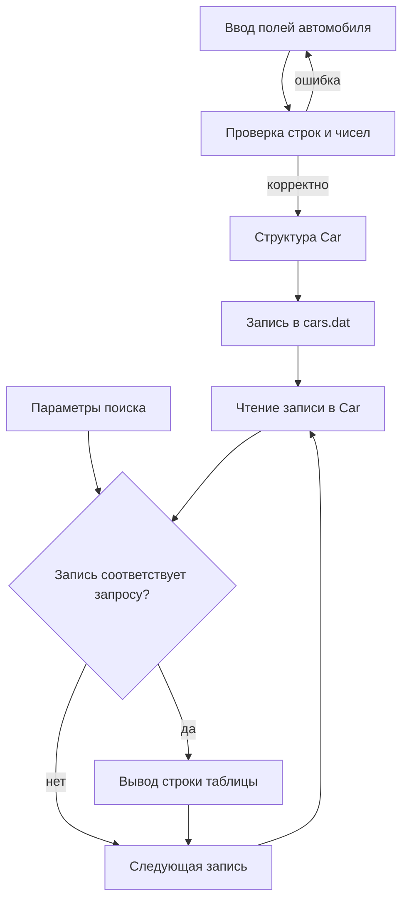

# Поток данных

## Работа с записью

Во всех версиях файл хранит записи, структура содержит текущий автомобиль, а переменные запроса задают критерий поиска. Указательная версия обращается к полям через `->`; остальные — через `.`.

## Модульная версия

`main.cpp` подключает три заголовочных файла: `input.h`, `output.h`, `search.h`. Структура `Car` определена в `output.h`; этот файл также подключают заголовки ввода и поиска. Каждый заголовок защищён от повторного включения.

| Функция | Входные данные | Результат |
| --- | --- | --- |
| `main()` | Номер пункта меню | Вызов добавления, просмотра или поиска |
| `addCar()` | Шесть полей автомобиля | Новая запись в файле |
| `showAll()` | Записи из файла | Таблица автомобилей |
| `findCar()` | Номер атрибута | Вызов соответствующей функции поиска |
| `searchByBrand/Model/Body/Segment()` | Подстрока и записи из файла | Вывод совпавших записей |
| `searchByYear/Price()` | Нижняя и верхняя границы, записи из файла | Вывод записей в интервале |
| `printHeader()` | — | Заголовки столбцов |
| `printCar(const Car&)` | Ссылка на запись | Строка таблицы |

## Пары «модуль — глобальная переменная»

По методичке `Rup = Aup / Pup`, где `Aup` — число фактических пар, `Pup` — число возможных пар. Пользовательских глобальных переменных в исходниках нет. Поэтому во всех версиях `Aup = 0`, `Pup = 0`, а `Rup` **не определён**: знаменатель равен нулю. Стандартные потоки `cin` и `cout` в множество переменных разработанной программы не включаются.

Локальные данные передаются в `printCar()` через параметр. Общий файл `cars.dat` является хранилищем данных, а не глобальной переменной C++.

