# Графы управления

Графы построены по текущим исходникам. Последовательные операторы объединены в базовые блоки; каждое условие — отдельная вершина. Составное логическое выражение считается одним условием. Дуги `case` и `default` учитываются отдельно. Вызовы функций показаны блоками. Номера вершин соответствуют [таблице вершин](graph-nodes.csv) и [таблице дуг](graph-edges.csv).

## Линейная

### main

Вершины: 145; дуги: 200; G = 200 − 145 + 2 = **57**. Sa = **622**; S₀ = **0.768489**.

Показать граф

```mermaid
flowchart TD
    N1["1. Конец"]
    N2["2. return 0"]
    N3{"3. choice != 0"}
    N4{"4. choice"}
    N5{"5. ! file"}
    N6["6. cout ‹‹ 'File open error' ‹‹ endl"]
    N9["9. file . write ( reinterpret_cast ‹ char * › ( and car ) , sizeof ( Car ) ); file . close ( );…"]
    N10["10. ofstream file ( 'cars.dat' , ios :: binary | ios :: app )"]
    N11{"11. cin . fail ( ) || strlen ( car . segment ) == 0"}
    N12["12. cin . getline ( car . segment , 10 )"]
    N13{"13. cin . fail ( )"}
    N16["16. cin . clear ( ); cin . ignore ( numeric_limits ‹ streamsize › :: max ( ) , ' n' ); cout ‹‹ '…"]
    N17["17. cout ‹‹ 'Segment cannot be empty' ‹‹ endl"]
    N19["19. cout ‹‹ 'Segment: '; cin . getline ( car . segment , 10 )"]
    N20{"20. cin . fail ( ) || strlen ( car . body ) == 0"}
    N21["21. cin . getline ( car . body , 20 )"]
    N22{"22. cin . fail ( )"}
    N25["25. cin . clear ( ); cin . ignore ( numeric_limits ‹ streamsize › :: max ( ) , ' n' ); cout ‹‹ '…"]
    N26["26. cout ‹‹ 'Body car cannot be empty' ‹‹ endl"]
    N29["29. cin . ignore ( numeric_limits ‹ streamsize › :: max ( ) , ' n' ); cout ‹‹ 'Body: '; cin . ge…"]
    N30{"30. ! ( cin ›› car . price ) || car . price ‹= 0"}
    N33["33. cout ‹‹ 'Wrong price. Enter positive number: '; cin . clear ( ); cin . ignore ( numeric_limi…"]
    N34["34. cout ‹‹ 'Price: '"]
    N35{"35. ! ( cin ›› car . year ) || car . year ‹ 1886 || car . year › 2026"}
    N38["38. cout ‹‹ 'Wrong year. Enter year from 1886 to 2026' ‹‹ endl; cin . clear ( ); cin . ignore ( …"]
    N39["39. cout ‹‹ 'Year: '"]
    N40{"40. cin . fail ( ) || strlen ( car . model ) == 0"}
    N41["41. cin . getline ( car . model , 30 )"]
    N42{"42. cin . fail ( )"}
    N45["45. cin . clear ( ); cin . ignore ( numeric_limits ‹ streamsize › :: max ( ) , ' n' ); cout ‹‹ '…"]
    N46["46. cout ‹‹ 'Model cannot be empty' ‹‹ endl"]
    N48["48. cout ‹‹ 'Model: '; cin . getline ( car . model , 30 )"]
    N49{"49. cin . fail ( ) || strlen ( car . brand ) == 0"}
    N50["50. cin . getline ( car . brand , 30 )"]
    N51{"51. cin . fail ( )"}
    N54["54. cin . clear ( ); cin . ignore ( numeric_limits ‹ streamsize › :: max ( ) , ' n' ); cout ‹‹ '…"]
    N55["55. cout ‹‹ 'Brand cannot be empty' ‹‹ endl"]
    N58["58. cin . ignore ( numeric_limits ‹ streamsize › :: max ( ) , ' n' ); cout ‹‹ 'Brand: '; cin . g…"]
    N59{"59. ! file"}
    N60["60. cout ‹‹ 'Error file read' ‹‹ endl"]
    N61["61. file . close ( )"]
    N62{"62. file . read ( reinterpret_cast ‹ char * › ( and car ) , sizeof ( Car ) )"}
    N63["63. cout ‹‹ left ‹‹ setw ( 31 ) ‹‹ car . brand ‹‹ setw ( 31 ) ‹‹ car . model ‹‹ setw ( 21 ) ‹‹ c…"]
    N65["65. cout ‹‹ left ‹‹ setw ( 31 ) ‹‹ 'Brand' ‹‹ setw ( 31 ) ‹‹ 'Model' ‹‹ setw ( 21 ) ‹‹ 'Body' ‹‹…"]
    N66["66. ifstream file ( 'cars.dat' , ios :: binary )"]
    N67{"67. searchChoice == 6"}
    N68{"68. ! file"}
    N69["69. cout ‹‹ 'File open error' ‹‹ endl"]
    N70["70. file . close ( )"]
    N71{"71. file . read ( reinterpret_cast ‹ char * › ( and car ) , sizeof ( Car ) )"}
    N72{"72. strstr ( car . segment , searchSegment ) != nullptr"}
    N73["73. cout ‹‹ left ‹‹ setw ( 31 ) ‹‹ car . brand ‹‹ setw ( 31 ) ‹‹ car . model ‹‹ setw ( 21 ) ‹‹ c…"]
    N75["75. cout ‹‹ left ‹‹ setw ( 31 ) ‹‹ 'Brand' ‹‹ setw ( 31 ) ‹‹ 'Model' ‹‹ setw ( 21 ) ‹‹ 'Body' ‹‹…"]
    N76["76. ifstream file ( 'cars.dat' , ios :: binary )"]
    N77{"77. cin . fail ( ) || strlen ( searchSegment ) == 0"}
    N78["78. cin . getline ( searchSegment , 10 )"]
    N79{"79. cin . fail ( )"}
    N82["82. cin . clear ( ); cin . ignore ( numeric_limits ‹ streamsize › :: max ( ) , ' n' ); cout ‹‹ '…"]
    N83["83. cout ‹‹ 'Segment cannot be empty' ‹‹ endl"]
    N87["87. char searchSegment [ 10 ]; cin . ignore ( numeric_limits ‹ streamsize › :: max ( ) , ' n' );…"]
    N88{"88. searchChoice == 5"}
    N89{"89. ! file"}
    N90["90. cout ‹‹ 'File open error' ‹‹ endl"]
    N91["91. file . close ( )"]
    N92{"92. file . read ( reinterpret_cast ‹ char * › ( and car ) , sizeof ( Car ) )"}
    N93{"93. strstr ( car . body , searchBody ) != nullptr"}
    N94["94. cout ‹‹ left ‹‹ setw ( 31 ) ‹‹ car . brand ‹‹ setw ( 31 ) ‹‹ car . model ‹‹ setw ( 21 ) ‹‹ c…"]
    N96["96. cout ‹‹ left ‹‹ setw ( 31 ) ‹‹ 'Brand' ‹‹ setw ( 31 ) ‹‹ 'Model' ‹‹ setw ( 21 ) ‹‹ 'Body' ‹‹…"]
    N97["97. ifstream file ( 'cars.dat' , ios :: binary )"]
    N98{"98. cin . fail ( ) || strlen ( searchBody ) == 0"}
    N99["99. cin . getline ( searchBody , 20 )"]
    N100{"100. cin . fail ( )"}
    N103["103. cin . clear ( ); cin . ignore ( numeric_limits ‹ streamsize › :: max ( ) , ' n' ); cout ‹‹ '…"]
    N104["104. cout ‹‹ 'Body cannot be empty' ‹‹ endl"]
    N108["108. char searchBody [ 20 ]; cin . ignore ( numeric_limits ‹ streamsize › :: max ( ) , ' n' ); co…"]
    N109{"109. searchChoice == 4"}
    N110{"110. ! file"}
    N111["111. cout ‹‹ 'File open error' ‹‹ endl"]
    N112["112. file . close ( )"]
    N113{"113. file . read ( reinterpret_cast ‹ char * › ( and car ) , sizeof ( Car ) )"}
    N114{"114. car . price ›= minPrice andand car . price ‹= maxPrice"}
    N115["115. cout ‹‹ left ‹‹ setw ( 31 ) ‹‹ car . brand ‹‹ setw ( 31 ) ‹‹ car . model ‹‹ setw ( 21 ) ‹‹ c…"]
    N117["117. cout ‹‹ left ‹‹ setw ( 31 ) ‹‹ 'Brand' ‹‹ setw ( 31 ) ‹‹ 'Model' ‹‹ setw ( 21 ) ‹‹ 'Body' ‹‹…"]
    N118["118. ifstream file ( 'cars.dat' , ios :: binary )"]
    N119{"119. ! ( cin ›› maxPrice ) || maxPrice ‹ 1 || maxPrice ‹ minPrice"}
    N122["122. cout ‹‹ 'Wrong price. Enter correct price.' ‹‹ endl; cin . clear ( ); cin . ignore ( numeric…"]
    N123["123. cout ‹‹ 'To price' ‹‹ endl"]
    N124{"124. ! ( cin ›› minPrice ) || minPrice ‹ 1"}
    N127["127. cout ‹‹ 'Wrong price. Enter correct price.' ‹‹ endl; cin . clear ( ); cin . ignore ( numeric…"]
    N130["130. int minPrice; int maxPrice; cout ‹‹ 'From price' ‹‹ endl"]
    N131{"131. searchChoice == 3"}
    N132{"132. ! file"}
    N133["133. cout ‹‹ 'File open error' ‹‹ endl"]
    N134["134. file . close ( )"]
    N135{"135. file . read ( reinterpret_cast ‹ char * › ( and car ) , sizeof ( Car ) )"}
    N136{"136. car . year ›= minYear andand car . year ‹= maxYear"}
    N137["137. cout ‹‹ left ‹‹ setw ( 31 ) ‹‹ car . brand ‹‹ setw ( 31 ) ‹‹ car . model ‹‹ setw ( 21 ) ‹‹ c…"]
    N139["139. cout ‹‹ left ‹‹ setw ( 31 ) ‹‹ 'Brand' ‹‹ setw ( 31 ) ‹‹ 'Model' ‹‹ setw ( 21 ) ‹‹ 'Body' ‹‹…"]
    N140["140. ifstream file ( 'cars.dat' , ios :: binary )"]
    N141{"141. ! ( cin ›› maxYear ) || maxYear ‹ 1886 || maxYear › 2026 || maxYear ‹ minYear"}
    N144["144. cout ‹‹ 'Wrong year. Enter year from ' ‹‹ minYear ‹‹ ' to 2026: '; cin . clear ( ); cin . ig…"]
    N145["145. cout ‹‹ 'To year: ' ‹‹ endl"]
    N146{"146. ! ( cin ›› minYear ) || minYear ‹ 1886 || minYear › 2026"}
    N149["149. cout ‹‹ 'Wrong year. Enter year from 1886 to 2026' ‹‹ endl; cin . clear ( ); cin . ignore ( …"]
    N152["152. int minYear; int maxYear; cout ‹‹ 'From year: ' ‹‹ endl"]
    N153{"153. searchChoice == 2"}
    N154{"154. ! file"}
    N155["155. cout ‹‹ 'File open error' ‹‹ endl"]
    N156["156. file . close ( )"]
    N157{"157. file . read ( reinterpret_cast ‹ char * › ( and car ) , sizeof ( Car ) )"}
    N158{"158. strstr ( car . model , searchModel ) != nullptr"}
    N159["159. cout ‹‹ left ‹‹ setw ( 31 ) ‹‹ car . brand ‹‹ setw ( 31 ) ‹‹ car . model ‹‹ setw ( 21 ) ‹‹ c…"]
    N161["161. cout ‹‹ left ‹‹ setw ( 31 ) ‹‹ 'Brand' ‹‹ setw ( 31 ) ‹‹ 'Model' ‹‹ setw ( 21 ) ‹‹ 'Body' ‹‹…"]
    N162["162. ifstream file ( 'cars.dat' , ios :: binary )"]
    N163{"163. cin . fail ( ) || strlen ( searchModel ) == 0"}
    N164["164. cin . getline ( searchModel , 30 )"]
    N165{"165. cin . fail ( )"}
    N168["168. cin . clear ( ); cin . ignore ( numeric_limits ‹ streamsize › :: max ( ) , ' n' ); cout ‹‹ '…"]
    N169["169. cout ‹‹ 'Model cannot be empty' ‹‹ endl"]
    N173["173. char searchModel [ 30 ]; cin . ignore ( numeric_limits ‹ streamsize › :: max ( ) , ' n' ); c…"]
    N174{"174. searchChoice == 1"}
    N175{"175. ! file"}
    N176["176. cout ‹‹ 'File open error' ‹‹ endl"]
    N177["177. file . close ( )"]
    N178{"178. file . read ( reinterpret_cast ‹ char * › ( and car ) , sizeof ( Car ) )"}
    N179{"179. strstr ( car . brand , searchBrand ) != nullptr"}
    N180["180. cout ‹‹ left ‹‹ setw ( 31 ) ‹‹ car . brand ‹‹ setw ( 31 ) ‹‹ car . model ‹‹ setw ( 21 ) ‹‹ c…"]
    N182["182. cout ‹‹ left ‹‹ setw ( 31 ) ‹‹ 'Brand' ‹‹ setw ( 31 ) ‹‹ 'Model' ‹‹ setw ( 21 ) ‹‹ 'Body' ‹‹…"]
    N183["183. ifstream file ( 'cars.dat' , ios :: binary )"]
    N184{"184. cin . fail ( ) || strlen ( searchBrand ) == 0"}
    N185["185. cin . getline ( searchBrand , 30 )"]
    N186{"186. cin . fail ( )"}
    N189["189. cin . clear ( ); cin . ignore ( numeric_limits ‹ streamsize › :: max ( ) , ' n' ); cout ‹‹ '…"]
    N190["190. cout ‹‹ 'Brand cannot be empty' ‹‹ endl"]
    N194["194. char searchBrand [ 30 ]; cin . ignore ( numeric_limits ‹ streamsize › :: max ( ) , ' n' ); c…"]
    N195{"195. ! ( cin ›› searchChoice ) || searchChoice ‹ 0 || searchChoice › 6"}
    N198["198. cout ‹‹ 'Wrong choice. Enter 0-6: '; cin . clear ( ); cin . ignore ( numeric_limits ‹ stream…"]
    N207["207. int searchChoice; cout ‹‹ 'search by: ' ‹‹ endl; cout ‹‹ '1 - brand' ‹‹ endl; cout ‹‹ '2 - m…"]
    N208["208. cout ‹‹ 'Exit' ‹‹ endl"]
    N209["209. cout ‹‹ 'Wrong choise' ‹‹ endl"]
    N210{"210. ! ( cin ›› choice ) || choice ‹ 0 || choice › 3"}
    N213["213. cout ‹‹ 'Enter a number: '; cin . clear ( ); cin . ignore ( numeric_limits ‹ streamsize › ::…"]
    N217["217. cout ‹‹ '1 - Add car' ‹‹ endl; cout ‹‹ '2 - Show all' ‹‹ endl; cout ‹‹ '3 - Search' ‹‹ endl;…"]
    N219["219. Car car; int choice"]
    N220["220. Начало"]
    N2 --> N1
    N6 --> N3
    N5 -->|да| N6
    N9 --> N3
    N5 -->|нет| N9
    N10 --> N5
    N12 --> N11
    N16 --> N12
    N13 -->|да| N16
    N17 --> N12
    N13 -->|нет| N17
    N11 -->|да| N13
    N11 -->|нет| N10
    N19 --> N11
    N21 --> N20
    N25 --> N21
    N22 -->|да| N25
    N26 --> N21
    N22 -->|нет| N26
    N20 -->|да| N22
    N20 -->|нет| N19
    N29 --> N20
    N33 --> N30
    N30 -->|да| N33
    N30 -->|нет| N29
    N34 --> N30
    N38 --> N35
    N35 -->|да| N38
    N35 -->|нет| N34
    N39 --> N35
    N41 --> N40
    N45 --> N41
    N42 -->|да| N45
    N46 --> N41
    N42 -->|нет| N46
    N40 -->|да| N42
    N40 -->|нет| N39
    N48 --> N40
    N50 --> N49
    N54 --> N50
    N51 -->|да| N54
    N55 --> N50
    N51 -->|нет| N55
    N49 -->|да| N51
    N49 -->|нет| N48
    N58 --> N49
    N4 -->|case 1| N58
    N60 --> N3
    N59 -->|да| N60
    N61 --> N3
    N63 --> N62
    N62 -->|да| N63
    N62 -->|нет| N61
    N65 --> N62
    N59 -->|нет| N65
    N66 --> N59
    N4 -->|case 2| N66
    N69 --> N3
    N68 -->|да| N69
    N70 --> N3
    N73 --> N71
    N72 -->|да| N73
    N72 -->|нет| N71
    N71 -->|да| N72
    N71 -->|нет| N70
    N75 --> N71
    N68 -->|нет| N75
    N76 --> N68
    N78 --> N77
    N82 --> N78
    N79 -->|да| N82
    N83 --> N78
    N79 -->|нет| N83
    N77 -->|да| N79
    N77 -->|нет| N76
    N87 --> N77
    N67 -->|да| N87
    N67 -->|нет| N3
    N90 --> N67
    N89 -->|да| N90
    N91 --> N67
    N94 --> N92
    N93 -->|да| N94
    N93 -->|нет| N92
    N92 -->|да| N93
    N92 -->|нет| N91
    N96 --> N92
    N89 -->|нет| N96
    N97 --> N89
    N99 --> N98
    N103 --> N99
    N100 -->|да| N103
    N104 --> N99
    N100 -->|нет| N104
    N98 -->|да| N100
    N98 -->|нет| N97
    N108 --> N98
    N88 -->|да| N108
    N88 -->|нет| N67
    N111 --> N88
    N110 -->|да| N111
    N112 --> N88
    N115 --> N113
    N114 -->|да| N115
    N114 -->|нет| N113
    N113 -->|да| N114
    N113 -->|нет| N112
    N117 --> N113
    N110 -->|нет| N117
    N118 --> N110
    N122 --> N119
    N119 -->|да| N122
    N119 -->|нет| N118
    N123 --> N119
    N127 --> N124
    N124 -->|да| N127
    N124 -->|нет| N123
    N130 --> N124
    N109 -->|да| N130
    N109 -->|нет| N88
    N133 --> N109
    N132 -->|да| N133
    N134 --> N109
    N137 --> N135
    N136 -->|да| N137
    N136 -->|нет| N135
    N135 -->|да| N136
    N135 -->|нет| N134
    N139 --> N135
    N132 -->|нет| N139
    N140 --> N132
    N144 --> N141
    N141 -->|да| N144
    N141 -->|нет| N140
    N145 --> N141
    N149 --> N146
    N146 -->|да| N149
    N146 -->|нет| N145
    N152 --> N146
    N131 -->|да| N152
    N131 -->|нет| N109
    N155 --> N131
    N154 -->|да| N155
    N156 --> N131
    N159 --> N157
    N158 -->|да| N159
    N158 -->|нет| N157
    N157 -->|да| N158
    N157 -->|нет| N156
    N161 --> N157
    N154 -->|нет| N161
    N162 --> N154
    N164 --> N163
    N168 --> N164
    N165 -->|да| N168
    N169 --> N164
    N165 -->|нет| N169
    N163 -->|да| N165
    N163 -->|нет| N162
    N173 --> N163
    N153 -->|да| N173
    N153 -->|нет| N131
    N176 --> N153
    N175 -->|да| N176
    N177 --> N153
    N180 --> N178
    N179 -->|да| N180
    N179 -->|нет| N178
    N178 -->|да| N179
    N178 -->|нет| N177
    N182 --> N178
    N175 -->|нет| N182
    N183 --> N175
    N185 --> N184
    N189 --> N185
    N186 -->|да| N189
    N190 --> N185
    N186 -->|нет| N190
    N184 -->|да| N186
    N184 -->|нет| N183
    N194 --> N184
    N174 -->|да| N194
    N174 -->|нет| N153
    N198 --> N195
    N195 -->|да| N198
    N195 -->|нет| N174
    N207 --> N195
    N4 -->|case 3| N207
    N208 --> N3
    N4 -->|case 0| N208
    N209 --> N3
    N4 -->|default| N209
    N213 --> N210
    N210 -->|да| N213
    N210 -->|нет| N4
    N217 --> N210
    N3 -->|да| N217
    N3 -->|нет| N2
    N219 --> N217
    N220 --> N219
```

## С указателями

### main

Вершины: 145; дуги: 200; G = 200 − 145 + 2 = **57**. Sa = **622**; S₀ = **0.768489**.

Показать граф

```mermaid
flowchart TD
    N1["1. Конец"]
    N3["3. delete car; return 0"]
    N4{"4. choice != 0"}
    N5{"5. choice"}
    N6{"6. ! file"}
    N7["7. cout ‹‹ 'File open error' ‹‹ endl"]
    N10["10. file . write ( reinterpret_cast ‹ char * › ( car ) , sizeof ( Car ) ); file . close ( ); cou…"]
    N11["11. ofstream file ( 'cars.dat' , ios :: binary | ios :: app )"]
    N12{"12. cin . fail ( ) || strlen ( car -› segment ) == 0"}
    N13["13. cin . getline ( car -› segment , 10 )"]
    N14{"14. cin . fail ( )"}
    N17["17. cin . clear ( ); cin . ignore ( numeric_limits ‹ streamsize › :: max ( ) , ' n' ); cout ‹‹ '…"]
    N18["18. cout ‹‹ 'Segment cannot be empty' ‹‹ endl"]
    N20["20. cout ‹‹ 'Segment: '; cin . getline ( car -› segment , 10 )"]
    N21{"21. cin . fail ( ) || strlen ( car -› body ) == 0"}
    N22["22. cin . getline ( car -› body , 20 )"]
    N23{"23. cin . fail ( )"}
    N26["26. cin . clear ( ); cin . ignore ( numeric_limits ‹ streamsize › :: max ( ) , ' n' ); cout ‹‹ '…"]
    N27["27. cout ‹‹ 'Body car cannot be empty' ‹‹ endl"]
    N30["30. cin . ignore ( numeric_limits ‹ streamsize › :: max ( ) , ' n' ); cout ‹‹ 'Body: '; cin . ge…"]
    N31{"31. ! ( cin ›› car -› price ) || car -› price ‹= 0"}
    N34["34. cout ‹‹ 'Wrong price. Enter positive number: '; cin . clear ( ); cin . ignore ( numeric_limi…"]
    N35["35. cout ‹‹ 'Price: '"]
    N36{"36. ! ( cin ›› car -› year ) || car -› year ‹ 1886 || car -› year › 2026"}
    N39["39. cout ‹‹ 'Wrong year. Enter year from 1886 to 2026' ‹‹ endl; cin . clear ( ); cin . ignore ( …"]
    N40["40. cout ‹‹ 'Year: '"]
    N41{"41. cin . fail ( ) || strlen ( car -› model ) == 0"}
    N42["42. cin . getline ( car -› model , 30 )"]
    N43{"43. cin . fail ( )"}
    N46["46. cin . clear ( ); cin . ignore ( numeric_limits ‹ streamsize › :: max ( ) , ' n' ); cout ‹‹ '…"]
    N47["47. cout ‹‹ 'Model cannot be empty' ‹‹ endl"]
    N49["49. cout ‹‹ 'Model: '; cin . getline ( car -› model , 30 )"]
    N50{"50. cin . fail ( ) || strlen ( car -› brand ) == 0"}
    N51["51. cin . getline ( car -› brand , 30 )"]
    N52{"52. cin . fail ( )"}
    N55["55. cin . clear ( ); cin . ignore ( numeric_limits ‹ streamsize › :: max ( ) , ' n' ); cout ‹‹ '…"]
    N56["56. cout ‹‹ 'Brand cannot be empty' ‹‹ endl"]
    N59["59. cin . ignore ( numeric_limits ‹ streamsize › :: max ( ) , ' n' ); cout ‹‹ 'Brand: '; cin . g…"]
    N60{"60. ! file"}
    N61["61. cout ‹‹ 'Error file read' ‹‹ endl"]
    N62["62. file . close ( )"]
    N63{"63. file . read ( reinterpret_cast ‹ char * › ( car ) , sizeof ( Car ) )"}
    N64["64. cout ‹‹ left ‹‹ setw ( 31 ) ‹‹ car -› brand ‹‹ setw ( 31 ) ‹‹ car -› model ‹‹ setw ( 21 ) ‹‹…"]
    N66["66. cout ‹‹ left ‹‹ setw ( 31 ) ‹‹ 'Brand' ‹‹ setw ( 31 ) ‹‹ 'Model' ‹‹ setw ( 21 ) ‹‹ 'Body' ‹‹…"]
    N67["67. ifstream file ( 'cars.dat' , ios :: binary )"]
    N68{"68. searchChoice == 6"}
    N69{"69. ! file"}
    N70["70. cout ‹‹ 'File open error' ‹‹ endl"]
    N71["71. file . close ( )"]
    N72{"72. file . read ( reinterpret_cast ‹ char * › ( car ) , sizeof ( Car ) )"}
    N73{"73. strstr ( car -› segment , searchSegment ) != nullptr"}
    N74["74. cout ‹‹ left ‹‹ setw ( 31 ) ‹‹ car -› brand ‹‹ setw ( 31 ) ‹‹ car -› model ‹‹ setw ( 21 ) ‹‹…"]
    N76["76. cout ‹‹ left ‹‹ setw ( 31 ) ‹‹ 'Brand' ‹‹ setw ( 31 ) ‹‹ 'Model' ‹‹ setw ( 21 ) ‹‹ 'Body' ‹‹…"]
    N77["77. ifstream file ( 'cars.dat' , ios :: binary )"]
    N78{"78. cin . fail ( ) || strlen ( searchSegment ) == 0"}
    N79["79. cin . getline ( searchSegment , 10 )"]
    N80{"80. cin . fail ( )"}
    N83["83. cin . clear ( ); cin . ignore ( numeric_limits ‹ streamsize › :: max ( ) , ' n' ); cout ‹‹ '…"]
    N84["84. cout ‹‹ 'Segment cannot be empty' ‹‹ endl"]
    N88["88. char searchSegment [ 10 ]; cin . ignore ( numeric_limits ‹ streamsize › :: max ( ) , ' n' );…"]
    N89{"89. searchChoice == 5"}
    N90{"90. ! file"}
    N91["91. cout ‹‹ 'File open error' ‹‹ endl"]
    N92["92. file . close ( )"]
    N93{"93. file . read ( reinterpret_cast ‹ char * › ( car ) , sizeof ( Car ) )"}
    N94{"94. strstr ( car -› body , searchBody ) != nullptr"}
    N95["95. cout ‹‹ left ‹‹ setw ( 31 ) ‹‹ car -› brand ‹‹ setw ( 31 ) ‹‹ car -› model ‹‹ setw ( 21 ) ‹‹…"]
    N97["97. cout ‹‹ left ‹‹ setw ( 31 ) ‹‹ 'Brand' ‹‹ setw ( 31 ) ‹‹ 'Model' ‹‹ setw ( 21 ) ‹‹ 'Body' ‹‹…"]
    N98["98. ifstream file ( 'cars.dat' , ios :: binary )"]
    N99{"99. cin . fail ( ) || strlen ( searchBody ) == 0"}
    N100["100. cin . getline ( searchBody , 20 )"]
    N101{"101. cin . fail ( )"}
    N104["104. cin . clear ( ); cin . ignore ( numeric_limits ‹ streamsize › :: max ( ) , ' n' ); cout ‹‹ '…"]
    N105["105. cout ‹‹ 'Body cannot be empty' ‹‹ endl"]
    N109["109. char searchBody [ 20 ]; cin . ignore ( numeric_limits ‹ streamsize › :: max ( ) , ' n' ); co…"]
    N110{"110. searchChoice == 4"}
    N111{"111. ! file"}
    N112["112. cout ‹‹ 'File open error' ‹‹ endl"]
    N113["113. file . close ( )"]
    N114{"114. file . read ( reinterpret_cast ‹ char * › ( car ) , sizeof ( Car ) )"}
    N115{"115. car -› price ›= minPrice andand car -› price ‹= maxPrice"}
    N116["116. cout ‹‹ left ‹‹ setw ( 31 ) ‹‹ car -› brand ‹‹ setw ( 31 ) ‹‹ car -› model ‹‹ setw ( 21 ) ‹‹…"]
    N118["118. cout ‹‹ left ‹‹ setw ( 31 ) ‹‹ 'Brand' ‹‹ setw ( 31 ) ‹‹ 'Model' ‹‹ setw ( 21 ) ‹‹ 'Body' ‹‹…"]
    N119["119. ifstream file ( 'cars.dat' , ios :: binary )"]
    N120{"120. ! ( cin ›› maxPrice ) || maxPrice ‹ 1 || maxPrice ‹ minPrice"}
    N123["123. cout ‹‹ 'Wrong price. Enter correct price.' ‹‹ endl; cin . clear ( ); cin . ignore ( numeric…"]
    N124["124. cout ‹‹ 'To price' ‹‹ endl"]
    N125{"125. ! ( cin ›› minPrice ) || minPrice ‹ 1"}
    N128["128. cout ‹‹ 'Wrong price. Enter correct price.' ‹‹ endl; cin . clear ( ); cin . ignore ( numeric…"]
    N131["131. int minPrice; int maxPrice; cout ‹‹ 'From price' ‹‹ endl"]
    N132{"132. searchChoice == 3"}
    N133{"133. ! file"}
    N134["134. cout ‹‹ 'File open error' ‹‹ endl"]
    N135["135. file . close ( )"]
    N136{"136. file . read ( reinterpret_cast ‹ char * › ( car ) , sizeof ( Car ) )"}
    N137{"137. car -› year ›= minYear andand car -› year ‹= maxYear"}
    N138["138. cout ‹‹ left ‹‹ setw ( 31 ) ‹‹ car -› brand ‹‹ setw ( 31 ) ‹‹ car -› model ‹‹ setw ( 21 ) ‹‹…"]
    N140["140. cout ‹‹ left ‹‹ setw ( 31 ) ‹‹ 'Brand' ‹‹ setw ( 31 ) ‹‹ 'Model' ‹‹ setw ( 21 ) ‹‹ 'Body' ‹‹…"]
    N141["141. ifstream file ( 'cars.dat' , ios :: binary )"]
    N142{"142. ! ( cin ›› maxYear ) || maxYear ‹ 1886 || maxYear › 2026 || maxYear ‹ minYear"}
    N145["145. cout ‹‹ 'Wrong year. Enter year from ' ‹‹ minYear ‹‹ ' to 2026: '; cin . clear ( ); cin . ig…"]
    N146["146. cout ‹‹ 'To year: ' ‹‹ endl"]
    N147{"147. ! ( cin ›› minYear ) || minYear ‹ 1886 || minYear › 2026"}
    N150["150. cout ‹‹ 'Wrong year. Enter year from 1886 to 2026' ‹‹ endl; cin . clear ( ); cin . ignore ( …"]
    N153["153. int minYear; int maxYear; cout ‹‹ 'From year: ' ‹‹ endl"]
    N154{"154. searchChoice == 2"}
    N155{"155. ! file"}
    N156["156. cout ‹‹ 'File open error' ‹‹ endl"]
    N157["157. file . close ( )"]
    N158{"158. file . read ( reinterpret_cast ‹ char * › ( car ) , sizeof ( Car ) )"}
    N159{"159. strstr ( car -› model , searchModel ) != nullptr"}
    N160["160. cout ‹‹ left ‹‹ setw ( 31 ) ‹‹ car -› brand ‹‹ setw ( 31 ) ‹‹ car -› model ‹‹ setw ( 21 ) ‹‹…"]
    N162["162. cout ‹‹ left ‹‹ setw ( 31 ) ‹‹ 'Brand' ‹‹ setw ( 31 ) ‹‹ 'Model' ‹‹ setw ( 21 ) ‹‹ 'Body' ‹‹…"]
    N163["163. ifstream file ( 'cars.dat' , ios :: binary )"]
    N164{"164. cin . fail ( ) || strlen ( searchModel ) == 0"}
    N165["165. cin . getline ( searchModel , 30 )"]
    N166{"166. cin . fail ( )"}
    N169["169. cin . clear ( ); cin . ignore ( numeric_limits ‹ streamsize › :: max ( ) , ' n' ); cout ‹‹ '…"]
    N170["170. cout ‹‹ 'Model cannot be empty' ‹‹ endl"]
    N174["174. char searchModel [ 30 ]; cin . ignore ( numeric_limits ‹ streamsize › :: max ( ) , ' n' ); c…"]
    N175{"175. searchChoice == 1"}
    N176{"176. ! file"}
    N177["177. cout ‹‹ 'File open error' ‹‹ endl"]
    N178["178. file . close ( )"]
    N179{"179. file . read ( reinterpret_cast ‹ char * › ( car ) , sizeof ( Car ) )"}
    N180{"180. strstr ( car -› brand , searchBrand ) != nullptr"}
    N181["181. cout ‹‹ left ‹‹ setw ( 31 ) ‹‹ car -› brand ‹‹ setw ( 31 ) ‹‹ car -› model ‹‹ setw ( 21 ) ‹‹…"]
    N183["183. cout ‹‹ left ‹‹ setw ( 31 ) ‹‹ 'Brand' ‹‹ setw ( 31 ) ‹‹ 'Model' ‹‹ setw ( 21 ) ‹‹ 'Body' ‹‹…"]
    N184["184. ifstream file ( 'cars.dat' , ios :: binary )"]
    N185{"185. cin . fail ( ) || strlen ( searchBrand ) == 0"}
    N186["186. cin . getline ( searchBrand , 30 )"]
    N187{"187. cin . fail ( )"}
    N190["190. cin . clear ( ); cin . ignore ( numeric_limits ‹ streamsize › :: max ( ) , ' n' ); cout ‹‹ '…"]
    N191["191. cout ‹‹ 'Brand cannot be empty' ‹‹ endl"]
    N195["195. char searchBrand [ 30 ]; cin . ignore ( numeric_limits ‹ streamsize › :: max ( ) , ' n' ); c…"]
    N196{"196. ! ( cin ›› searchChoice ) || searchChoice ‹ 0 || searchChoice › 6"}
    N199["199. cout ‹‹ 'Wrong choice. Enter 0-6: '; cin . clear ( ); cin . ignore ( numeric_limits ‹ stream…"]
    N208["208. int searchChoice; cout ‹‹ 'search by: ' ‹‹ endl; cout ‹‹ '1 - brand' ‹‹ endl; cout ‹‹ '2 - m…"]
    N209["209. cout ‹‹ 'Exit' ‹‹ endl"]
    N210["210. cout ‹‹ 'Wrong choise' ‹‹ endl"]
    N211{"211. ! ( cin ›› choice ) || choice ‹ 0 || choice › 3"}
    N214["214. cout ‹‹ 'Enter a number: '; cin . clear ( ); cin . ignore ( numeric_limits ‹ streamsize › ::…"]
    N218["218. cout ‹‹ '1 - Add car' ‹‹ endl; cout ‹‹ '2 - Show all' ‹‹ endl; cout ‹‹ '3 - Search' ‹‹ endl;…"]
    N220["220. Car * car = new Car; int choice"]
    N221["221. Начало"]
    N3 --> N1
    N7 --> N4
    N6 -->|да| N7
    N10 --> N4
    N6 -->|нет| N10
    N11 --> N6
    N13 --> N12
    N17 --> N13
    N14 -->|да| N17
    N18 --> N13
    N14 -->|нет| N18
    N12 -->|да| N14
    N12 -->|нет| N11
    N20 --> N12
    N22 --> N21
    N26 --> N22
    N23 -->|да| N26
    N27 --> N22
    N23 -->|нет| N27
    N21 -->|да| N23
    N21 -->|нет| N20
    N30 --> N21
    N34 --> N31
    N31 -->|да| N34
    N31 -->|нет| N30
    N35 --> N31
    N39 --> N36
    N36 -->|да| N39
    N36 -->|нет| N35
    N40 --> N36
    N42 --> N41
    N46 --> N42
    N43 -->|да| N46
    N47 --> N42
    N43 -->|нет| N47
    N41 -->|да| N43
    N41 -->|нет| N40
    N49 --> N41
    N51 --> N50
    N55 --> N51
    N52 -->|да| N55
    N56 --> N51
    N52 -->|нет| N56
    N50 -->|да| N52
    N50 -->|нет| N49
    N59 --> N50
    N5 -->|case 1| N59
    N61 --> N4
    N60 -->|да| N61
    N62 --> N4
    N64 --> N63
    N63 -->|да| N64
    N63 -->|нет| N62
    N66 --> N63
    N60 -->|нет| N66
    N67 --> N60
    N5 -->|case 2| N67
    N70 --> N4
    N69 -->|да| N70
    N71 --> N4
    N74 --> N72
    N73 -->|да| N74
    N73 -->|нет| N72
    N72 -->|да| N73
    N72 -->|нет| N71
    N76 --> N72
    N69 -->|нет| N76
    N77 --> N69
    N79 --> N78
    N83 --> N79
    N80 -->|да| N83
    N84 --> N79
    N80 -->|нет| N84
    N78 -->|да| N80
    N78 -->|нет| N77
    N88 --> N78
    N68 -->|да| N88
    N68 -->|нет| N4
    N91 --> N68
    N90 -->|да| N91
    N92 --> N68
    N95 --> N93
    N94 -->|да| N95
    N94 -->|нет| N93
    N93 -->|да| N94
    N93 -->|нет| N92
    N97 --> N93
    N90 -->|нет| N97
    N98 --> N90
    N100 --> N99
    N104 --> N100
    N101 -->|да| N104
    N105 --> N100
    N101 -->|нет| N105
    N99 -->|да| N101
    N99 -->|нет| N98
    N109 --> N99
    N89 -->|да| N109
    N89 -->|нет| N68
    N112 --> N89
    N111 -->|да| N112
    N113 --> N89
    N116 --> N114
    N115 -->|да| N116
    N115 -->|нет| N114
    N114 -->|да| N115
    N114 -->|нет| N113
    N118 --> N114
    N111 -->|нет| N118
    N119 --> N111
    N123 --> N120
    N120 -->|да| N123
    N120 -->|нет| N119
    N124 --> N120
    N128 --> N125
    N125 -->|да| N128
    N125 -->|нет| N124
    N131 --> N125
    N110 -->|да| N131
    N110 -->|нет| N89
    N134 --> N110
    N133 -->|да| N134
    N135 --> N110
    N138 --> N136
    N137 -->|да| N138
    N137 -->|нет| N136
    N136 -->|да| N137
    N136 -->|нет| N135
    N140 --> N136
    N133 -->|нет| N140
    N141 --> N133
    N145 --> N142
    N142 -->|да| N145
    N142 -->|нет| N141
    N146 --> N142
    N150 --> N147
    N147 -->|да| N150
    N147 -->|нет| N146
    N153 --> N147
    N132 -->|да| N153
    N132 -->|нет| N110
    N156 --> N132
    N155 -->|да| N156
    N157 --> N132
    N160 --> N158
    N159 -->|да| N160
    N159 -->|нет| N158
    N158 -->|да| N159
    N158 -->|нет| N157
    N162 --> N158
    N155 -->|нет| N162
    N163 --> N155
    N165 --> N164
    N169 --> N165
    N166 -->|да| N169
    N170 --> N165
    N166 -->|нет| N170
    N164 -->|да| N166
    N164 -->|нет| N163
    N174 --> N164
    N154 -->|да| N174
    N154 -->|нет| N132
    N177 --> N154
    N176 -->|да| N177
    N178 --> N154
    N181 --> N179
    N180 -->|да| N181
    N180 -->|нет| N179
    N179 -->|да| N180
    N179 -->|нет| N178
    N183 --> N179
    N176 -->|нет| N183
    N184 --> N176
    N186 --> N185
    N190 --> N186
    N187 -->|да| N190
    N191 --> N186
    N187 -->|нет| N191
    N185 -->|да| N187
    N185 -->|нет| N184
    N195 --> N185
    N175 -->|да| N195
    N175 -->|нет| N154
    N199 --> N196
    N196 -->|да| N199
    N196 -->|нет| N175
    N208 --> N196
    N5 -->|case 3| N208
    N209 --> N4
    N5 -->|case 0| N209
    N210 --> N4
    N5 -->|default| N210
    N214 --> N211
    N211 -->|да| N214
    N211 -->|нет| N5
    N218 --> N211
    N4 -->|да| N218
    N4 -->|нет| N3
    N220 --> N218
    N221 --> N220
```

## Модульная

### main

Вершины: 14; дуги: 19; G = 19 − 14 + 2 = **7**. Sa = **28**; S₀ = **0.535714**.

Показать граф

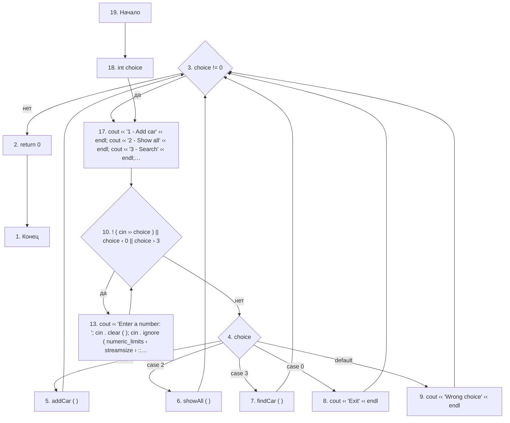

### addCar

Вершины: 36; дуги: 46; G = 46 − 36 + 2 = **12**. Sa = **63**; S₀ = **0.444444**.

Показать граф

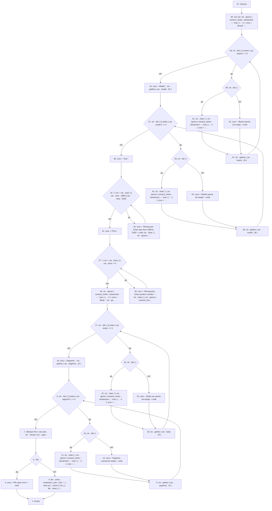

### showAll

Вершины: 9; дуги: 10; G = 10 − 9 + 2 = **3**. Sa = **14**; S₀ = **0.428571**.

Показать граф

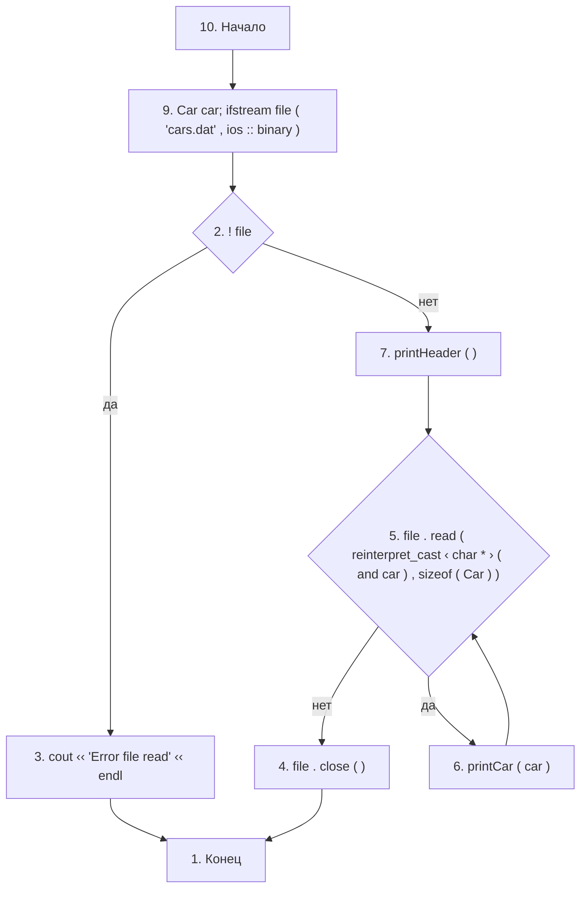

### findCar

Вершины: 12; дуги: 19; G = 19 − 12 + 2 = **9**. Sa = **18**; S₀ = **0.388889**.

Показать граф

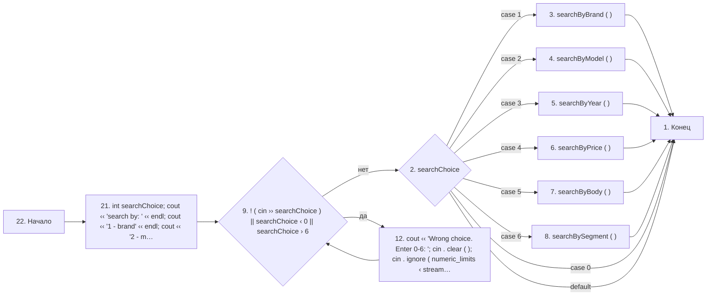

### searchByBrand

Вершины: 16; дуги: 20; G = 20 − 16 + 2 = **6**. Sa = **30**; S₀ = **0.500000**.

Показать граф

### searchByModel

Вершины: 16; дуги: 20; G = 20 − 16 + 2 = **6**. Sa = **30**; S₀ = **0.500000**.

Показать граф

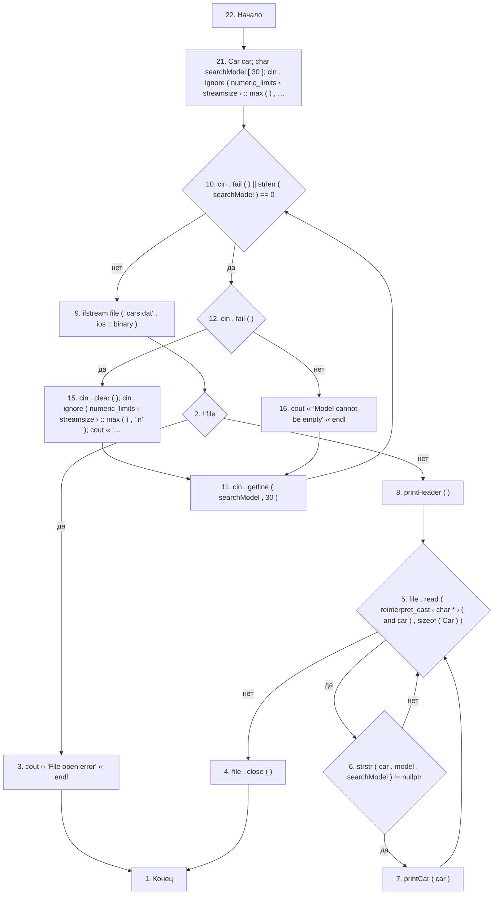

### searchByYear

Вершины: 16; дуги: 20; G = 20 − 16 + 2 = **6**. Sa = **26**; S₀ = **0.423077**.

Показать граф

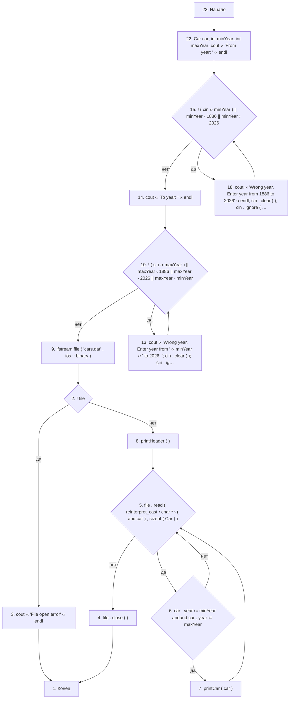

### searchByPrice

Вершины: 16; дуги: 20; G = 20 − 16 + 2 = **6**. Sa = **26**; S₀ = **0.423077**.

Показать граф

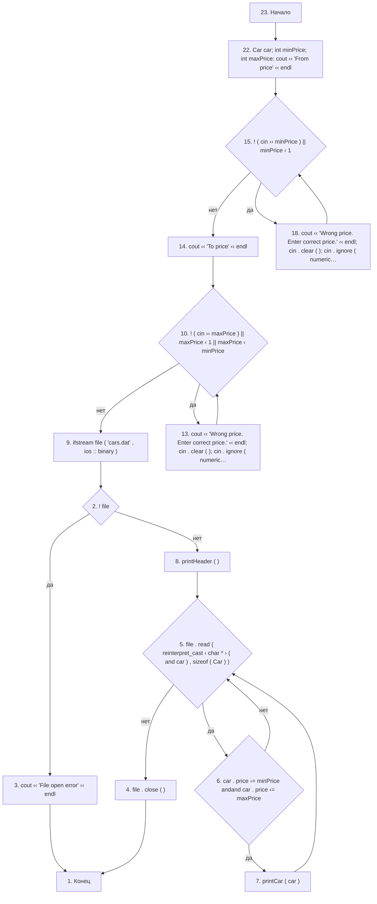

### searchByBody

Вершины: 16; дуги: 20; G = 20 − 16 + 2 = **6**. Sa = **30**; S₀ = **0.500000**.

Показать граф

### searchBySegment

Вершины: 16; дуги: 20; G = 20 − 16 + 2 = **6**. Sa = **30**; S₀ = **0.500000**.

Показать граф

### printHeader

Вершины: 3; дуги: 2; G = 2 − 3 + 2 = **1**. Sa = **2**; S₀ = **0.000000**.

Показать граф

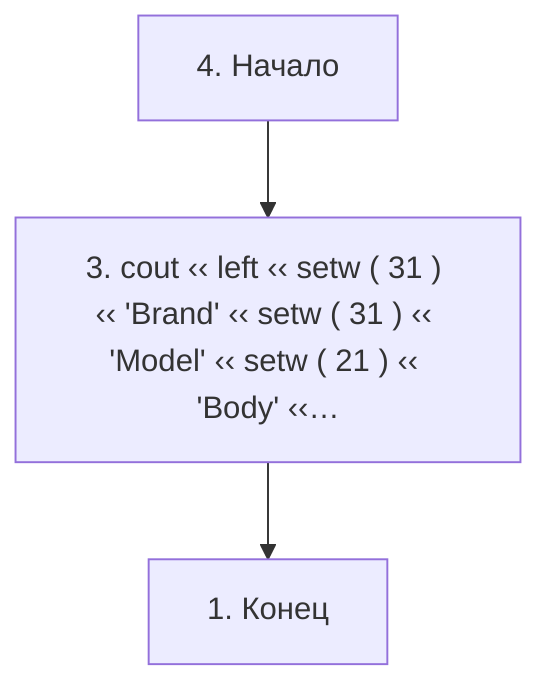

### printCar

Вершины: 3; дуги: 2; G = 2 − 3 + 2 = **1**. Sa = **2**; S₀ = **0.000000**.

Показать граф

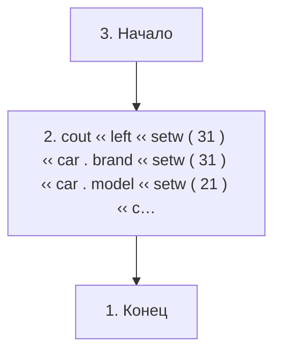

